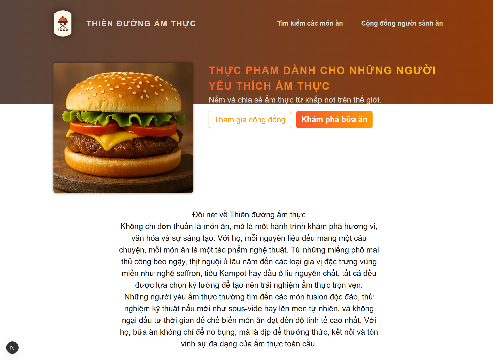
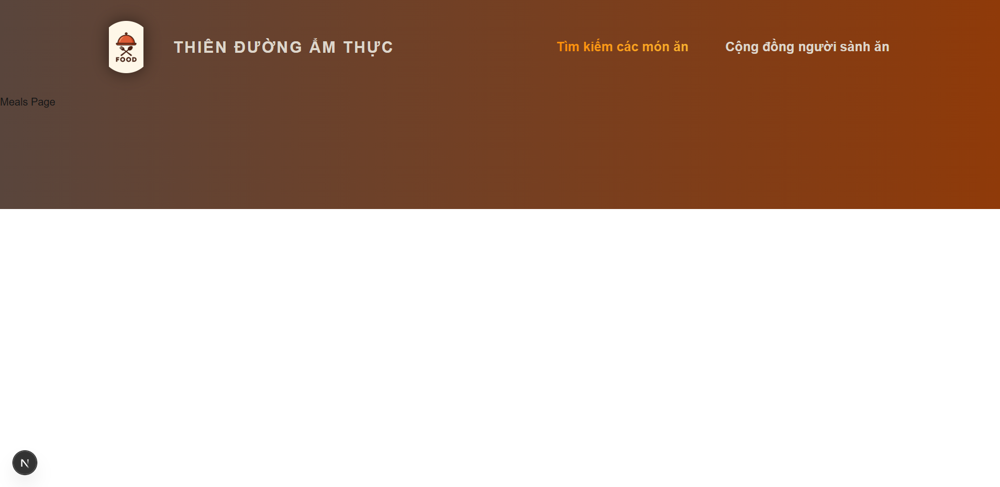

Create new project `npx create-next-app@latest <project-name>`

Reserved Filenames

- page.js => Create a new page (e.g., app/about/page.js creates a <your-domain>/about page)
- layout.js => Create a new layout that wraps sibling and nested pages
- not-found.js => Fallback page for "Not Found" errors (thrown by sibling or nested pages or layouts)
- error.js => Fallback page for other errors (thrown by sibling pages or nested pages or layouts)
- loading.js => Fallback page which is shown whilst sibling or nested pages (or layouts) are fetching data
- route.js => Allows you to create an API route (i.e., a page which does NOT return JSX code but instead data, e.g., in the JSON format)

Run file initdb.ts: `npx tsx initdb.ts`
Then file meals.db is auto created

# Trang chủ

# Trang các món ăn (Đang cập nhật)

# Trang cộng đồng

